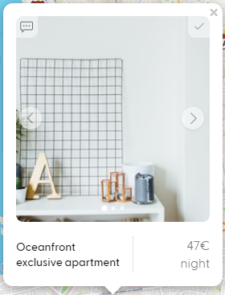

# Report

Il progetto sviluppato ai fini dell'esame di Applicazioni Web è un sito volto ad offrire un servizio di bed and breakfast in diverse località nel mondo in base alle preferenze dell'utente. L'idea fondamentale è quella di permettere a quest'ultimo di filtrare gli alloggi in base ad una serie di criteri che vanno dalla posizione geografica alla struttura dell'alloggio e di vedere i risultati così ottenuti su una mappa. La consultazione degli alloggi è offerta a qualunque utente ma per poter usufruire degli altri servizi ci si dovrà iscrivere abilitando l'accesso alla propria area privata. Questa include pagine relative ai messaggi, alle prenotazioni e al profilo.  
D'altra parte, gli utenti amministratori possono accedere a una sezione nella quale sono abilitati a controllare quasi ogni aspetto del servizio web. In particolare, possono rispondere ai messaggi degli utenti, accettare o rifiutare le prenotazioni e modificare, rimuovere o inserire nuovi alloggi.  
La directory `utilities` contiene una serie di file non necessari al funzionamento dell'applicazione ma che sono stati utili per la sua costruzione.  
Per avviare l'app basta installare le dependecies, digitare `npm start` nella directory principale del progetto e visitare l'indirizzo `localhost:3000`. Per iscriversi come utente amministratore, il codice segreto (definito nel file `.env`) è "`1234`".  
L'aaplicazione è in funzione pubblicamente all'indirizzo <https://cozy-web-app.herokuapp.com>

## Front-end

La parte relativa al client è stata sviluppata attraverso pagine HTML statiche, senza l'ausilio di un render engine. Ciò si è rivelato alquanto scomodo per l'aggiunta di nuovi elementi alle pagine e per la distribuzione delle stesse attraverso *express* (l'uso del metodo `sendFile()` piuttosto che di `render()`).  
Lo stile generale e gli adattamenti necessari a rendere l'interfaccia grafica responsive sono stati ottenuti attraverso documenti *css* puri.  
Sono state, inoltre, utilizzate delle librerie esterne che hanno facilitato la rappresentazione della mappa e del grafico dei prezzi. La prima è *LeafletJS* e la seconda *ChartJS*.  
Visto che non è possibile settare gli headers quando viene richiesto un URL diretto o quando viene premuto un link, nel caso l'utente sia autenticato, gli URL sono automaticamente aggiornati dal client per includere il JWT, permettendo così di accedere alle pagine private.

### Homepage

Nella versione desktop è divisa in due sezioni principali: la sinistra contenente la mappa e la destra con i filtri. Nella versione mobile, invece, queste due sezioni sono concatenate verticalmente per carenza di spazio orizzontale. Inoltre, sempre per questo motivo, l'istogramma dei prezzi non mostra gli intervalli nell'asse delle x.  

Per richiedere una ricerca al server è sufficiente selezionare una località e delle date ma si possono facoltativamente inserire ulteriori filtri per i quali il server cercherà gli alloggi che soddisfanno il numero inserito. Ad esempio: inserendo un numero di adulti pari a 2, il server riporterà tutte le strutture che ammettono un numero di ospiti adulti pari o superiore a 2. I prezzi, invece, possono essere filtrati solo dopo la prima ricerca nella località desiderata in quanto devono essere anzitutto caricati il minimo ed il massimo prezzo per quella località. I risultati riportati sono quelli delle strutture attualmente disponibili per le date indicate, cioè non verranno mostrate le strutture che hanno prenotazioni in stato *accepted* o *pending*.  
Una volta premuto il pulsante **Search** verrà renderizzata la mappa ed un messaggio indicante il numero di risultati ottenuti. Nel caso in cui siano presenti dei risultati, questi saranno segnalati dalla presenza di marker in punti specifici della mappa. Premendo su questi si aprirà un popup contenente le informazioni essenziali dell'alloggio, in particolare: il nome, il prezzo e le foto degli interni. Queste foto sono state ottenute attraverso lo script `unsplash.js` dall'API omonimo con la keyword *interiors* e non sono state sottoposte ad un controllo dei contenuti, perciò, in alcuni casi, non sono del tutto pertinenti a interni di dimore.  
Il popup contiene, inoltre, i pulsanti che permettono di svolgere le principali operazioni: premendo la vignetta in alto a sinistra si aprirà una conversazione con la struttura, premendo la spunta in alto a destra si potrà prenotare l'alloggio.  
Nel caso in cui non ci siano risultati, per centrare la mappa verrà utilizzata l'API Opencage che restituisce le coordinate della località richiesta.

### Messages

Tutte le pagine della sezione privata sono strutturate allo stesso modo. Quella dei messaggi contiene la lista delle chat aperte. Gli utenti sono gli unici a poter aprire una chat con una struttura, non può avvenire il contrario. Da questa pagina si può, inoltre, accedere alle singole chat nelle quali si possono consultare e scrivere i messaggi. Non si possono cancellare le chat.

### Bookings

Da questa pagina l'utente può vedere le proprie prenotazioni e il loro stato. Le prenotazioni possono essere cancellate solo dagli utenti. In questo caso, se la prenotazione era in stato *pending* o *accepted*, la struttura coinvolta nella prenotazione sarà nuovamente disponibile in quelle date.

### Profile

Qui l'utente può inserire e modificare i propri dati e un'immagine del profilo (che sarà in seguito sempre visibile nell'elemento header delle varie pagine). Per modificare l'immagine basta cliccare su **Edit** o sull'immagine stessa e questo genererà un evento legato al `<input>` incluso nel form relativo all'immagine. Questo permette di rendere invisibile il pulsante di default di questo tipo di `<input>` poiché ad esso non si può applicare alcuno stile. Il form in questione include anche un `<input>` di tipo *hidden* che viene riempito con il valore del JWT affinché il caricamento dell'immagine sia un'operazione autorizzata.
Sono presenti anche le funzionalità relativa al cambio di password e all'eliminazione del proprio account. In quest'ultimo caso, ovviamente, verranno eliminate anche le relative prenotazioni e chat.  
Infine, si può fare il log out che elimina il cookie JWT e reindirizza alla pagina di log in.

### Log in / Sign up

La pagina contiene due form alternabili:

- **Log in**: form che manda la richiesta di autenticazione al server e, in caso di risposta positiva, conferisce al client un cookie contenente il JWT che include nel proprio payload la variabile `_id` del *document* relativo allo user.
- **Sign up**: form contenente un checkbox da spuntare nel caso ci si voglia iscrivere in qualità di amministratore (questo richiederà di inserire un codice segreto). Se lo username inserito appartiene già ad un altro utente o il codice segreto non è corretto, l'errore verrà segnalato.

### Admin page

La pagina principale dell'utente amministratore contiene 3 sezioni:

- La prima sezione serve a rispondere ai messaggi degli utenti in qualità di gestore dell'alloggio.
- La seconda sezione permette di gestire le prenotazioni che, una volta generate dall'utente, entrano nella stato *pending*, e successivamente possono essere contrassegnate come *accepted* o *rejected*. In quest'ultimo caso, l'alloggio interessato diventa nuovamente disponibile nelle date della prenotazione rifiutata.
- La terza sezione contiene tutti gli alloggi del database. Questi possono essere consultati ed eventualmente modificati in tutti gli aspetti o rimossi (eliminando ogni chat e prenotazione ad esso associati).

Infine si può inserire un nuovo alloggio riempiendo un form apposito nel quale si può scegliere una località tra quelle già presenti nel database o una nuova che verrà salvata assieme all'alloggio.

## Back-end

La parte server è costruita su *expressJS* ed appositi middleware necessari a gestire i diversi aspetti della comunicazione HTTP. La struttura di base del progetto è stata creata attraverso *express-generator* che ha inizializzato la directory e generato i file essenziali.  
La comunicazione con il database (MongoDB Cloud Atlas) è gestita attraverso *mongoose*.  
La struttura del back end è essenzialmente la seguente: con il comando `npm start` si avvia lo script `bin/www` che chiama il file `app.js` avviando così il server. Qui vengono importati gli strumenti middleware e i router. Ogni router gestisce i propri percorsi attraverso i metodi `get()`, `post()` e `delete()`, chiamando le funzioni necessarie a svolgere le operazioni richieste. Queste funzioni sono, spesso, metodi esportati dai vari controller, i quali offrono strumenti di interazione con i *document* del database. I *document* sono creati sulla base dei file inclusi nella directory `models`.  
Sono presenti, inoltre alcune altre dependencies:

- Jimp: una libreria di manipolazione delle immagini necessaria a comprimere e ridimensionare le immagini caricate dagli utenti
- Multer: uno strumento per il caricamento di file da form (utilizzato per le immagini)
- Serve-favicon: un middleware che distribuisce il file *favicon.ico*
- Async: usato nello script `populate_database.js`
- Dotenv: utilizzato per gestire le variabili contenute nel file di node `.env`
- Unsplash-js e Node-Fetch: per lo script `unsplash.js`  

Solo nella funzione `isLogged()` (nel file `routes/index.js`) si valuta la presenza di un cookie contenente il JWT per valutare la necessità di reindirizzare un utente nel caso esso stia richiedendo la pagina di log in ma sia già stato autenticato.
